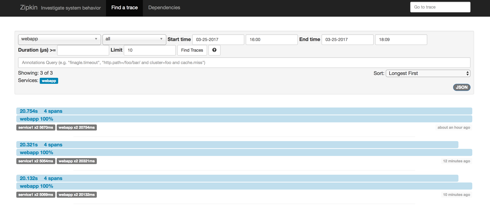
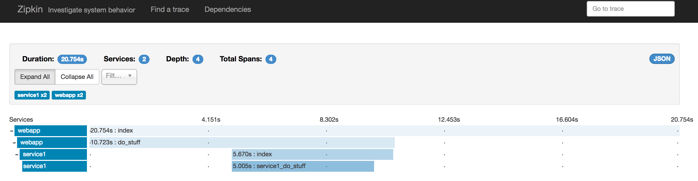

# Distributed Tracing via Zipkin

## Setting up Zipkin

To get persistent storage of traces in elastic search, we will first create a data container:

```
$ docker create --name esdata openzipkin/zipkin-elasticsearch
```

Then, execute ``./start_zipkin.sh`` to start the Zipkin server and ElasticSearch node that it talks
to for storing the data.

The docker compose files are those provided by [zipkin](https://github.com/openzipkin/docker-zipkin), but
the ``docker-compose-elasticsearch.yml`` has this additional command to allow persistent storage by
using the volumes from the above data container:

```
+    volumes_from:
+      - container:esdata
```

## Demo

You need ``py_zipkin`` and ``flask`` installed:

- Start demo web application (``python demo.py``)
- Start service1 it talks to ``python service.py``)
- Make a HTTP get request to demo web application (``curl localhost:5000``)

Go to ``localhost:9411`` and click on "Find Traces" after selecting "webapp" in the top left.

Each request creates a trace:



Each trace then shows the data about a single request:




